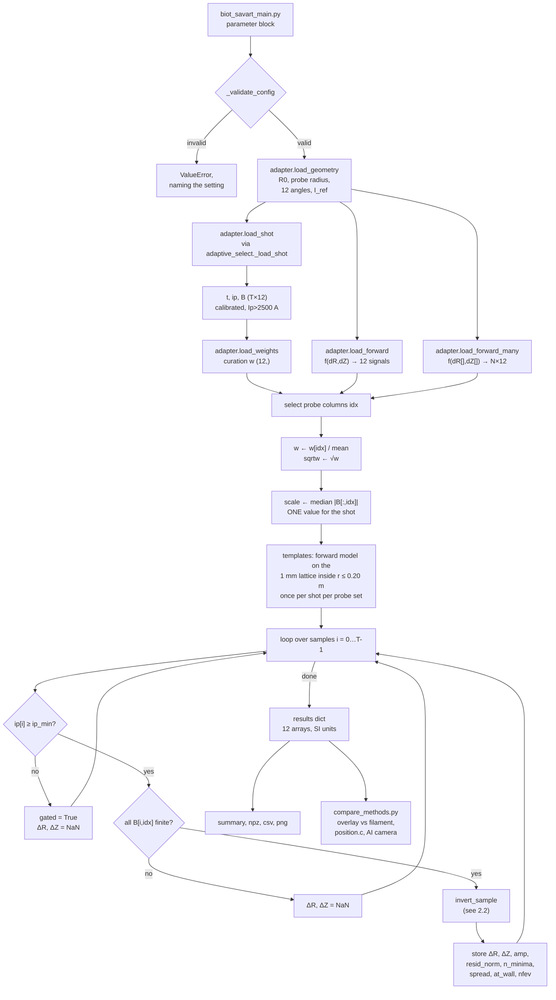
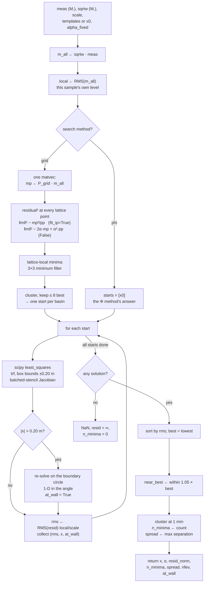

# The Biot–Savart NLSQ displacement method

How the method works, top to bottom. Written for a reader who knows the TT-1
project but has not seen this code.

Companion documents: `methods_script/biot_savart/README.md` covers interpretation
and current results; this document covers mechanism.

---

## 1. What the method does, in one paragraph

At each time sample the twelve magnetic probes report a tangential field
`B₁…B₁₂`. A toroidal current filament displaced by `(ΔR, ΔZ)` from the vessel
centre produces a predictable pattern across those twelve probes. The method
searches over `(ΔR, ΔZ)` for the displacement whose predicted pattern best
matches the measured one, in a weighted least-squares sense, and reports that
displacement. The prediction uses the exact Biot–Savart field of a circular
loop — no linearisation, no tabulation, no interpolation.

This is the same physical model the filament (Φ) method uses. The difference is
purely in how the inverse problem is solved: Φ linearises the forward map, builds
a lookup table of the inverse, and reads the answer off it; this method solves
the nonlinear problem numerically at every sample.

---

## 2. Flowchart

### 2.1 Whole-shot pipeline



### 2.2 One sample: `invert_sample`



---

## 3. Algorithm

Notation: `M` probes selected, `T` samples, `I_ref = parameters.I = 1e5 A`.

```
ALGORITHM  Biot–Savart NLSQ displacement

INPUT   shot number; probe subset P; weight source; fit_ip; search
OUTPUT  ΔR[t], ΔZ[t] in metres, plus per-sample diagnostics

── Setup ───────────────────────────────────────────────────────────────
 1  (R₀, a_p, θ₁…θ₁₂, I_ref) ← parameters.py
 2  (t, ip, B) ← adaptive_select._load_shot(shot)     # T×12, Ip>2500 A
 3  w ← curation weights over P
 4  w ← w / mean(w)                                   # only ratios matter
 5  sqrtw ← √w                                        # min Σwr² ⇒ vector √w·r
 6  scale ← median |B[:, P]|                          # one value, whole shot

 7  if search = "grid":                               # once per shot per set
 8      lattice ← {(ΔR,ΔZ) on a 1 mm grid, ΔR² + ΔZ² ≤ 0.20²}
 9      P_grid  ← sqrtw · forward(lattice)            # (N_grid, M) templates
10      pp      ← rowwise P_grid · P_grid

── Per-sample loop ─────────────────────────────────────────────────────
11  for i = 0 … T−1:
12      if ip_min set and |ip[i]| < ip_min:  gated[i] ← true;  continue
13      if any B[i,P] not finite:            continue
14      m ← sqrtw ⊙ B[i,P];   local ← RMS(m)
15      α_fix ← none  if fit_ip  else  ip[i]/I_ref

16      if search = "grid":                           # exhaustive, one matvec
17          mp ← P_grid · m
18          r² ← ‖m‖² − mp²/pp                        if fit_ip
19                ‖m‖² − 2·α_fix·mp + α_fix²·pp       otherwise
20          starts ← lattice-local minima of r², clustered, best 8
21      else:                                         # search = "phi"
22          starts ← [ the Φ method's answer for sample i ]

23      for each start s:
24          x ← least_squares(resid, s, jac=J, bounds ±0.20)
25          if |x| > 0.20:  x ← best point on the boundary circle
                            at_wall ← true
26          collect ( RMS(resid(x)) · local/scale , x )

27      best     ← lowest rms
28      near     ← all collected with rms ≤ 1.05 × best rms
29      n_minima ← distinct points in `near`, merge tolerance 1 mm
30      record ΔR,ΔZ ← best.x; amp; resid_norm; n_minima; spread;
               nfev; at_wall

── Residual  resid(x) ──────────────────────────────────────────────────
31  p ← sqrtw ⊙ forward(x)
32  α ← α_fix  if given  else  (m·p)/(p·p)            # profiled amplitude
33  return (m − α·p) / local

── Forward model  forward(ΔR, ΔZ) ──────────────────────────────────────
34  probe positions:   R_p = R₀ + a_p·cos θ ,  Z_p = a_p·sin θ
35  filament radius:   a_f = R₀ + ΔR ,  at height ΔZ
36  separation:        ζ = Z_p − ΔZ
37  elliptic parameter m = 4·a_f·R_p / ((a_f+R_p)² + ζ²)
38  B_r, B_z from K(m), E(m)                          # exact loop field
39  return −B_r·sin θ + B_z·cos θ                     # tangential projection
```

---

## 4. The parts, one at a time

### 4.1 `adapter.py` — the boundary with the rest of the repo

Every dependency on `parameters.py`, `signal_strength.py` and
`adaptive_select.py` is resolved in this one file, so an upstream API change
breaks one place with one message rather than six.

| function | returns | notes |
|---|---|---|
| `load_geometry()` | `Geometry(R0, probe_radius, angles, I_ref)` | `R0 = 0.65 m`, `probe_radius = 0.321 m` (**not** position.c's 0.29 m — a different circle), angles from `coil_angle_dict` ordered by probe 1…12, `I_ref = 1e5 A` |
| `load_forward(kind)` | `f(ΔR, ΔZ) → (12,)` | `"internal"` = `field.py`; `"cal_signal"` = the repository's own |
| `load_forward_many()` | `f(ΔR[], ΔZ[]) → (N,12)` | always `field.py`; `cal_signal` takes scalars only |
| `load_shot(shot)` | `(t, ip, B)` with `B` as `T×12` | wraps `_load_shot`, which returns `B` as a dict and gates at `Ip > 2500 A` |
| `load_weights(shot, src)` | `(12,)` or `None` | wraps `shot_weights`; probes absent from the dict default to 1.0 |

Reading the shot through `_load_shot` is deliberate: it means this method
inherits **exactly** the same calibration and vacuum-field subtraction as the Φ
path. That makes the comparison between the two meaningful, and it is also the
reason the comparison cannot say anything about the calibration itself.

### 4.2 `field.py` — the forward model

The tangential field at probe *i* for a filament at `(ΔR, ΔZ)`.

Probes sit on a circle of radius `a_p = 0.321 m` about `(R₀, 0)`, at measured
(unevenly spaced) angles `θᵢ`, so probe *i* is at
`R_p = R₀ + a_p cos θᵢ`, `Z_p = a_p sin θᵢ`.

The filament is a circular loop of radius `a_f = R₀ + ΔR` at height `ΔZ`. The
exact field of such a loop is the standard complete-elliptic-integral
expression, evaluated at vertical separation `ζ = Z_p − ΔZ`. Projection onto the
probe's circumferential axis gives `−B_r sin θ + B_z cos θ`.

Two implementation points that matter:

- **`scipy.special.ellipk`/`ellipe` take the parameter `m = k²`, not the modulus
  `k`.** Passing `k` yields a field that is wrong by a few percent and otherwise
  entirely plausible. Test T1 checks against the elementary on-axis closed form,
  which contains no elliptic integrals, precisely to catch this.
- **The function is vectorised over displacement points.** `ΔR`, `ΔZ` may be
  arrays; the return is `(N, 12)`. This exists so the Jacobian's whole
  finite-difference stencil goes in one call.

`field.py` and `cal_signal` are two implementations of the same equations.
Selftest stage 2 compares them over a grid; they currently agree to **2e-15**,
which fixes the conventions `DZ_SIGN = −1` and `TANGENTIAL_SIGN = +1`.

### 4.3 `invert.py` — the solver

#### The residual

For one sample with measurement `m` and prediction `p(ΔR, ΔZ)`:

```
rᵢ = √wᵢ · (mᵢ − α·pᵢ) / local
```

Three things are going on.

**Weights.** Minimising `Σ wᵢ rᵢ²` means the residual *vector* handed to the
solver is `√wᵢ · rᵢ`. Curation weights are inverse-variance and span four orders
of magnitude, so they are rescaled to mean 1 first. Only their ratios ever
affected the fit; the rescale exists so that `resid_norm` is comparable and so
that the cold-restart trigger fires on genuinely bad fits rather than on every
sample.

**The amplitude `α`.** `cal_signal` is evaluated at `I_ref = 1e5 A`, and
`adaptive_select._proxy` normalises measured signals by `ip/I_ref`, so a filament
at measured current `ip` should produce `cal_signal(...) × ip/I_ref`. Two modes:

- `fit_ip = True` (default) eliminates `α` analytically at every `(ΔR, ΔZ)`:
  `α* = Σwᵢmᵢpᵢ / Σwᵢpᵢ²`. Only the *ratios between probes* then enter the fit —
  which is what carries position information. `α` becomes an **output** that
  should equal `ip/I_ref` exactly, making it a free calibration diagnostic.
- `fit_ip = False` fixes `α = ip/I_ref`, so the absolute level enters the fit and
  a calibration error surfaces as a position error instead.

The flag carries the same meaning as `mprobe.MProbeEstimator`'s `fit_ip`, and is
named for it. Degrees of freedom differ: with M probes, `True` leaves M − 3 and
`False` leaves M − 2.

`adaptive_select._estimator` hardcodes `fit_ip=False`, so a `|ΔR_BS − ΔR_Φ|`
comparison against the adaptive path is only like-for-like when `fit_ip = False`
is set here too.

**`local`.** The residual is divided by this sample's own weighted RMS, not by
the shot's. `least_squares`' `ftol`/`gtol` act on the residual's absolute size,
so without this a low-signal sample (early or late in the discharge) would meet
the convergence test sooner and be solved to a looser accuracy than a
peak-current one. The reported `resid_norm` is converted back to the shot-wide
`scale` afterwards, so it stays comparable across samples.

#### The Jacobian

Only two free parameters, so a finite-difference Jacobian is cheap — but the
default `jac="2-point"` would make one forward call per column. Instead both
perturbed points go through `forward_many` in a single batched call with step
`h = 1e-7 m`. Verified against a much larger step (`1e-5`) with zero relative
difference.

#### Finding the global minimum

The forward model at a lattice point does not depend on which sample is being
solved — only the measurement does. So the model is evaluated once per shot on a
1 mm lattice covering the chamber, and the residual at every lattice point for a
given sample is one matrix–vector product. With the amplitude profiled out,
minimising the residual is the same as maximising `(m·p)²/(p·p)`, a normalised
cross-correlation against each template.

Every lattice-local minimum of that surface is refined by a continuous
least-squares solve, so the lattice chooses which basins to examine and never
limits the accuracy of the answer. Subject to it being fine enough to place a
point in every basin, the result is the **global** minimum inside the chamber
rather than whichever minimum a starting guess happened to reach. Refining the
step and confirming the set of minima does not change is the way to test that.

Cost is one matvec plus one refinement per basin: about 7–8 ms per sample on all
12 probes, after a 1 s, 12 MB template build per shot per probe set.

**There is no warm start.** Every sample is solved independently of every other,
so no question of drift or start order arises.

The alternative, `search = "phi"`, refines a single point: the filament method's
own answer. It has no fallback to the grid, because a poor fit from that start
is the finding rather than something to retry away. Running both separates a
Φ-versus-Biot–Savart gap into approximation error within one basin, and Φ having
landed in a different basin altogether.

#### The chamber

`CHAMBER_RADIUS = 0.20 m`, a disc rather than a box. The TT-1 limiter sits
0.20 m from the vessel centre, so a filament further out has no physical
meaning; the probe circle at 0.321 m, where the field diverges, stays well
clear. A solution on the boundary is flagged `at_wall`, meaning the best fit
inside the chamber lies on the limiter radius — a statement about the shot, not
about the solver. `least_squares` takes box bounds only, so a refinement that
leaves the disc is re-solved on the boundary circle, where the constraint
reduces to a single angle.

#### Counting minima

Solutions from all starts are sorted by residual. Those within 1.05× the best
are clustered with a 1 mm tolerance; `n_minima` is the cluster count and
`spread_m` the largest separation. `n_minima > 1` means more than one filament
position reproduces these signals, so the sample is ambiguous and no method can
resolve it from these probes alone.

From the grid search this count is a property of the residual surface, so it
detects a degeneracy that every start of a multi-start scheme could have missed.
From `search = "phi"` it is always 1 and says nothing. Selftest stage 3 separates
*degeneracy* (a different position fits equally well) from *solver failure* (the
recovered
fit is worse than truth).

### 4.4 Entry points

| entry point | how parameters are set | for |
|---|---|---|
| `biot_savart_main.py` (repo root) | edit the block at the top | normal use, matching `main.py`'s convention |
| `methods_script/biot_savart/cli.py` | command-line flags | scripted or batch runs |
| `compare_methods.py` | `BS_*` config block | overlay against filament, position.c, AI camera |

`biot_savart_main.py` validates its configuration before touching any data, so a
contradictory setting fails immediately with a message naming it.

### 4.5 Two quantities called "noise"

Two unrelated things could each be called noise, and the distinction matters
when reading any figure in this document.

**Fit residual** — the mismatch between the measured probe signals and the
signals the model predicts at the fitted position. It is what `resid_norm`
reports, it exists on every real shot, and it contains everything the model does
not capture: instrument noise, calibration error, eddy currents, and the failure
of a single filament to describe a real current profile. It is not a noise level
and cannot be converted into one.

**Injected noise** — a gaussian perturbation added deliberately to *synthetic*
probe signals in the tests, as a fraction of the median |B|. It exists only
inside `tests.py` and `selftest.py` stage 1, never on real data, and its purpose
is to measure how far the solver's answer moves for a known perturbation.

Quoting an injected-noise figure as though it described a real shot, or reading
`resid_norm` as a noise level, are both mistakes.

### 4.6 Verification

`selftest.py` — run once per checkout, before quoting any number.

1. **Synthetic recovery**: prescribe `(ΔR, ΔZ)`, generate synthetic signals, add
   injected noise, invert. Runs without the repository.
2. **Convention check**: `field.py` vs `cal_signal` over a grid; reports which
   sign convention matches and whether they agree at all. This is the gate.
3. **Fold probe**: invert noise-free synthetic signals from a grid of true
   positions, per probe set, and report where a different position fits equally
   well.

`tests.py` — 17 checks, no repository or shot data needed. T1–T3 are the only
ones that can catch an error in the field formula itself, because everything
after them generates and inverts with the same code: T1 against the elementary
on-axis closed form and the far-field dipole limit, T2 against `∇·B = 0` and
`∇×B = 0` off the wire, T3 against mirror symmetry. T4 measures the
injected-noise budget on synthetic signals, T5 amplitude invariance, T6
trajectory tracking and start-order independence, T7 degradation on dead probes, NaNs,
the Ip gate and probe subsets.

---

## 5. Output fields

All SI. Millimetres appear only in printed summaries, CSV and plots.

| field | meaning |
|---|---|
| `dR_m`, `dZ_m` | displacement, metres |
| `amp` | fitted amplitude; should equal `ip/I_ref` |
| `resid_norm` | weighted RMS **fit residual** ÷ shot median \|B\|, dimensionless. A mismatch between model and measurement, not a noise level. |
| `at_wall` | fit sat on the solver bound — **not a position** |
| `n_minima` | distinct minima found; >1 means ambiguous |
| `spread_m` | separation between those minima |
| `gated` | excluded by the Ip gate, not a failed fit |
| `nfev` | function evaluations spent, for cost accounting |

**Nothing is dropped for fitting badly.** A bad fit is reported with a large
`resid_norm`; acceptance thresholds belong to the caller.

---

## 6. What the method does and does not remove

Removed — four sources of approximation error, all internal to the pipeline:

- the cylindrical `R₀ → ∞` linearisation to `(ΔU, ΔV)`
- the third-order polynomial mapping the proxy back to `(ΔR, ΔZ)`
- Φ tabulation on a 0.5 mm grid, bicubic interpolation, and the `shift_domain`
  limit that comes with it

**Not removed, because Φ removed it already.** The paper's Eq. 6 retrieves its
polynomial coefficients using *tₙ₋₁'s answer*, so error propagates from sample to
sample — the paper says so explicitly, calling a simultaneous fit at tₙ
computationally infeasible. The 2D Φ map replaced that with a joint inversion of
`(u, v) → (ΔR, ΔZ)`, which is exactly the simultaneous fit Eq. 6 avoided, made
feasible by tabulating it. `mprobe.shift()` is therefore already stateless. This
method is stateless too, by per-sample optimisation rather than by tabulation.
The two are equal on this point; only the legacy 1D path (`coefficient.py` /
`plasma_shift.py`) still carries Eq. 6's structure.

Shared, and therefore invisible to this method:

- the probe calibration `k_t, k_oh, k_v` and the vacuum-field subtraction
- the single-filament ansatz itself — no current-density profile
- eddy currents and localised field perturbations
- probe positions, orientations, and the curation weights

So agreement with the filament method means *the linearisation is not the
problem*. It cannot vouch for anything the two share.

One asymmetry runs the other way. The Φ path projects the measurement onto two
or three linear combinations, which discards most per-probe error; this method
compares all twelve absolute field levels and sees it. A probe that disagrees
with the model is therefore visible here and largely invisible in Φ. On shot
1641 probes 11 and 12 read the opposite sign to the model — a real discrepancy,
of undetermined cause, which the curation weights already suppress by two to
three orders of magnitude. See the module README for the measured figures.
